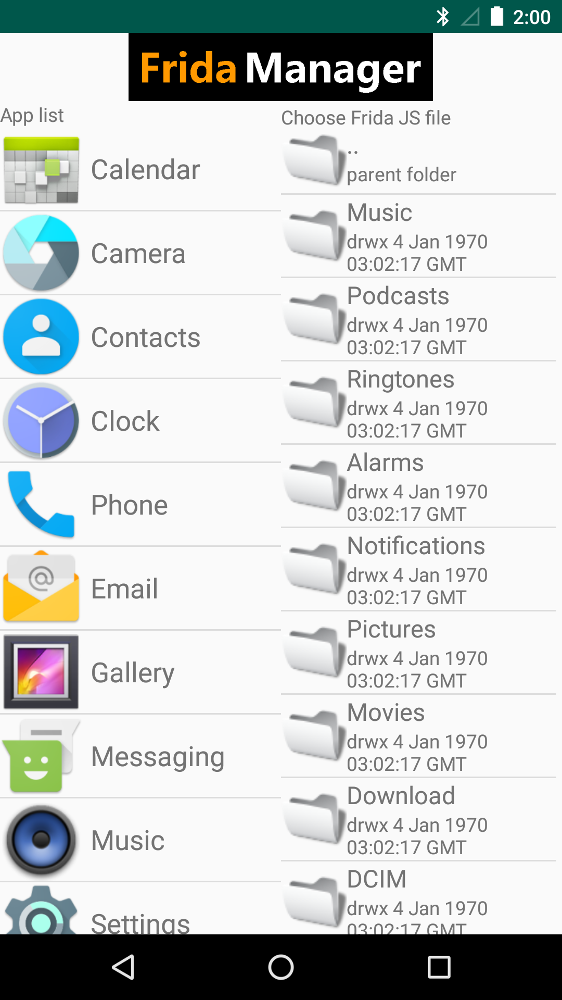
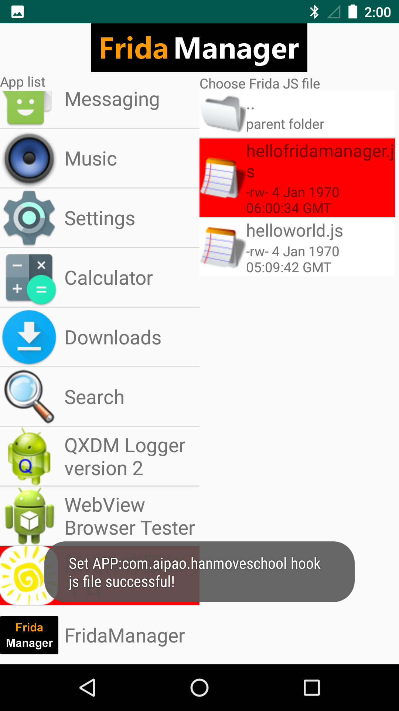
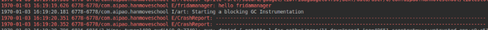
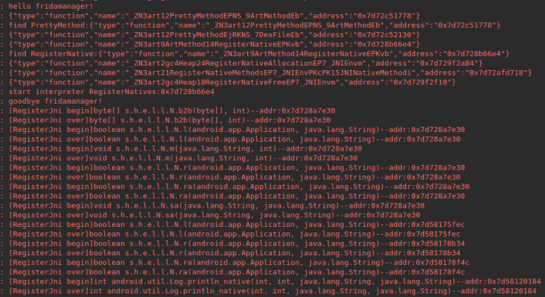
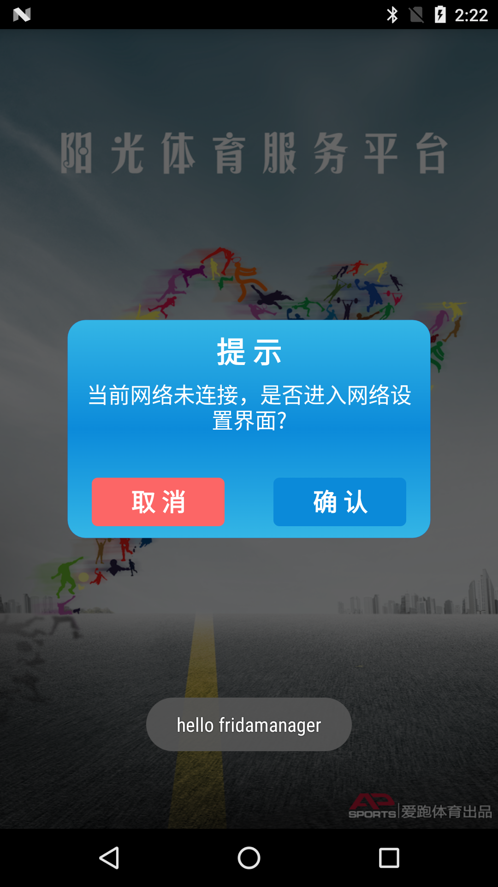
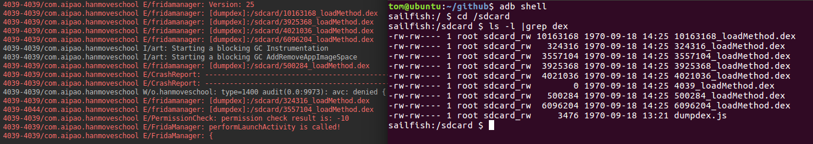
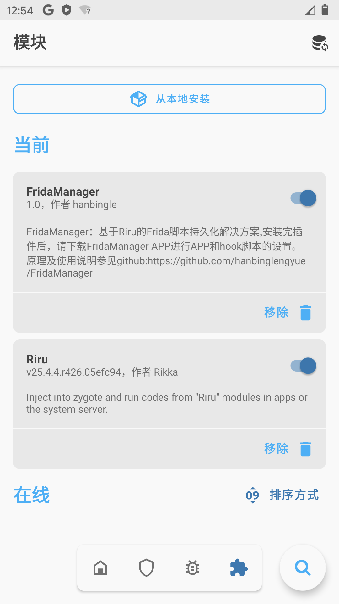

# FridaManager:Frida脚本持久化解决方案
## FridaManager持久化原理简介
Frida强大的功能让无数安全研究人员沉溺其中。我们往往使用pc编写好frida的js脚本，然后使用spawn或者attach的方式使得我们的hook脚本生效。那么能否做到像Xposed一样，让我们编写的hook脚本不依赖于pc，从而达到hook脚本的持久化呢？同时，是否能够在手机上单独设置哪一个js脚本只对哪一个app生效呢？答案是可以，得益于fridagadget共享库的强大功能，可以让我们达成frida脚本的持久化！众所周知，要想使用fridagadget，就需要对app进行重打包，注入该so库，首先，鉴于众多app开发人员安全意识的增强，app大多都会对签名进行校验，使得重打包后的app并不会正常的运行，往往会伴随大量的crash。同时，众多加固厂商的技术也不容小觑。不管是从重打包繁琐的流程还是从app保护的角度出发，对app进行重打包来使用fridagadget都不是一个良好的解决方案。那么有没有一个一劳永逸同时足够简单的方案呢？自然是有，我们依然从app的生命周期出发，在我在FART系列脱壳文章中针对加壳app的运行流程做了简单的介绍，当我们点击一个app的图标后，最先进入的便是ActivityThread这个类，同时，不同于对加固app的脱壳，需要选择尽可能晚的时机来完成对已经解密dex的dump和修复，要想对任意一款app实现Frida hook脚本的持久化，我们的hook时机应当是尽可能的早，如果时机晚了，就可能会错过对app中自身类函数的hook时机，比如壳自身的类函数。因此，我们对于fridagadget注入的时机至少要早于app自身声明的APPlication子类的attachBaseContext函数的调用。因此，我们依然可以从ActivityThread中选择足够多的时机（只要还没有完成对APPlication子类的attachBaseContext函数的调用的时机都可以）。同时，我们又可以根据不同的app的包名来对当前运行的app进程注入不同的js脚本，这样，我们就不仅能够实现对Frida脚本的持久化，同时，还能够根据配置，针对不同的app进程，选择不同的js脚本。FridaManager就是基于此原理实现。
## FridaManager使用流程
### 1、下载FridaManager定制rom，刷入手机
这里暂时只提供了nexus 5x的7.1.2 ,之后会放出Android 10的FridaManager版本rom，后期根据需求会逐步增加更多版本rom。
### 2、在手机中安装FridaManager app
安装后进入设置授予该app读写sd卡权限，FridaManager app主要用于方便对不同的app选择需要持久化的js脚本，界面非常简单（请忽略FridaManager丑陋的界面......）

### 3、在手机中安装要进行持久化hook的目标app
特别注意：安装完成后不要立即打开该app，同时注意到设置中授予该app读写sd卡权限（因为接下来要读取位于sd卡中的配置文件以及要持久化的js文件）

### 4、点击进入FridaManager主界面，完成对要持久化hook的app的设置
FridaManager的主界面主要分为两块，左边是用于选择要持久化的app；在选择好要进行注入的app后，接下来可以通过右边选择对其持久化的js脚本文件，此时可通过进入js脚本所在目录，点击选中。
当选中要持久化的app以及其对应的js脚本后，会弹出对话框，这时，便配置成功 (如下图)。

接下来只需要退出FridaManager，打开要持久化hook的app即可，这便是FridaManager的简单的使用流程。（同时，需要注意，当修改了需要持久化的js脚本文件后，需要kill掉app进程，重新打开才能生效）

## 体验第一个FridaManager持久化脚本：FridaManager版本的helloworld,将下面代码保存命名为helloworld.js，拷贝到手机sd卡当中。
```javascript
function Log(info) {
    Java.perform(function () {
        var LogClass = Java.use("android.util.Log");
        LogClass.e("FridaManager", info);
    })
}
function main() {
    Log("hello fridamanager!");
    Log("goodbye fridamanager!");
}

setImmediate(main);
```
代码逻辑非常清晰，只是使用Frida对Log类函数进行了主动调用，打印出hello fridamanager!以及goodbye fridamanager!这两个字符串.
接下来，我们只需要设置该frida脚本生效的app（由于需要读取sd卡，自然app需要有sd卡读写权限）。此时，需要使用FridaManager进行对特定app的配置，配置该app需要持久化的该js脚本，然后打开app，便可看到logcat中的信息：



## 更进一步，编写FridaManager持久化脚本跟踪jni函数的静态绑定以及动态绑定流程
将下面代码保存命名为traceJNIRegisterNative.js，拷贝到手机sd卡当中
```javascript
function Log(info) {
    Java.perform(function () {
        var LogClass = Java.use("android.util.Log");
        LogClass.e("FridaManager", info);
    })
}

function readStdString(str) {
    const isTiny = (str.readU8() & 1) === 0;
    if (isTiny)
        return str.add(1).readUtf8String();
    return str.add(2 * Process.pointerSize).readPointer().readUtf8String();
}
function hook_register_native() {
    var libartmodule = Process.getModuleByName("libart.so");
    var PrettyMethodaddr = null;
    var RegisterNativeaddr = null;
    libartmodule.enumerateExports().forEach(function (symbol) {
        //android7.1.2
        if (symbol.name == "_ZN3art12PrettyMethodEPNS_9ArtMethodEb") {
            PrettyMethodaddr = symbol.address;
        }
    });

    var PrettyMethodfunc = new NativeFunction(PrettyMethodaddr, ["pointer", "pointer", "pointer"], ["pointer", "int"]);
    Interceptor.attach(RegisterNativeaddr, {
        onEnter: function (args) {
            var ArtMethodptr = args[0];
            this.JniFuncaddr = args[1];
            var result = PrettyMethodfunc(ArtMethodptr, 1);
            var stdstring = Memory.alloc(3 * Process.pointerSize);
            ptr(stdstring).writePointer(result[0]);
            ptr(stdstring).add(1 * Process.pointerSize).writePointer(result[1]);
            ptr(stdstring).add(2 * Process.pointerSize).writePointer(result[2]);
            this.funcnamestring = readStdString(stdstring);
            Log("[RegisterJni begin]" + this.funcnamestring + "--addr:" + this.JniFuncaddr);
        }, onLeave: function (retval) {
            Log("[RegisterJni over]" + this.funcnamestring + "--addr:" + this.JniFuncaddr);
        }
    })
}
function main() {
    Log("hello fridamanager!");
    hook_register_native();
    Log("goodbye fridamanager!");
}
setImmediate(main);
```
接下来安装一个加壳了的app，并到设置中授予sd卡读写权限，之后在FridaManager中完成对该app要持久化的traceJNIRegisterNative.js的配置，
接下来只需要打开该app，便可以观察到该app中每一个jni函数的绑定流程（包括静态注册和动态注册的jni函数）。



## 编写FridaManager插件，在app启动时弹出hello friamanager对话框
将plugins目录下的Toast.js文件拷贝到sd卡当中，使用FridaManager设置好要hook生效的对应app以及Toast.js脚本文件。此时点击app即可看到如下图效果，在app下方成功弹出hello fridamanager对话框。
下面为Toast.js的代码内容
```javascript
//typed by hanbingle,just for fun!!
//email:edunwu@gmail.com
//由于FridaManager加载js脚本的时机较早，此时application实例还没有创建完成，因此需要特别注意

function LOG(info) {
    Java.perform(function () {
        var LogClass = Java.use("android.util.Log");
        LogClass.e("fridamanager", info);
    })
}

function Toast() {
    Java.perform(function () {
        LOG("go into Toast");
        var LoadedApkClass = Java.use("android.app.LoadedApk");
        LOG(LoadedApkClass.toString());
        LoadedApkClass.makeApplication.implementation = function (arg0, arg1) {
            var application = this.makeApplication(arg0, arg1);
            LOG(LoadedApkClass.toString());
            if (application != null) {
                var context = application.getApplicationContext();
                if (context != null) {
                    Java.scheduleOnMainThread(function () {
                        var toast = Java.use("android.widget.Toast");
                        toast.makeText(context, Java.use("java.lang.String").$new("hello fridamanager"), 1).show();
                    });
                }
            } else {
                LOG("application is null!");
            }
            return application;
        }
    });
    LOG("leave Toast");
}

function main() {
    LOG("go into main");
    Toast();
    LOG("leave main");
}

setImmediate(main);

```

之所以拿这个作为实例讲解，是因为FridaManager对于要持久化的js脚本加载的时机较早，此时application实例还没有创建，因此，便可以先hook住LoadedApk类的makeApplication函数，等待application对象创建成功以后再弹出对话框。

## 编写FridaManager插件，完成对app运行过程中加载的所有dex的简单dump
将plugins目录下的dumpdex.js文件拷贝到sd卡当中，使用FridaManager设置好要hook生效的对应app以及dumpdex.js脚本文件。此时点击app即可看到如下图效果:
下面为dumpdex.js的代码内容
```javascript
//typed by hanbingle,just for fun!!
//email:edunwu@gmail.com
//基于FridaManager的简单dumpdex脚本插件,对app加载的所有dex进行简单的dump

var ishook_libart = false;
var addrLoadMethod = null;
//默认保存到sdcard根目录下
var savepath = "/sdcard";
var version = 0;
function LOG(info) {
    Java.perform(function () {
        var LogClass = Java.use("android.util.Log");
        LogClass.e("fridamanager", info);
    })
}

function getversion() {
    Java.perform(function () {
        var ver = Java.use('android.os.Build$VERSION');
        version = ver.SDK_INT.value;
        LOG("Version: " + version);
    })
}
function hookart() {
    if (ishook_libart === true) {
        return;
    }
    var symbols = Module.enumerateSymbolsSync("libart.so");
    for (var i = 0; i < symbols.length; i++) {
        var symbol = symbols[i];
        //_ZN3art11ClassLinker10LoadMethodERKNS_7DexFileERKNS_21ClassDataItemIteratorENS_6HandleINS_6mirror5ClassEEEPNS_9ArtMethodE
        if (symbol.name.indexOf("ClassLinker") >= 0
            && symbol.name.indexOf("LoadMethod") >= 0
            && symbol.name.indexOf("DexFile") >= 0
            && symbol.name.indexOf("ClassDataItemIterator") >= 0
            && symbol.name.indexOf("ArtMethod") >= 0) {
            addrLoadMethod = symbol.address;
            break;
        }
    }
    /*Android11	11	API 级别 30
      Android10	10	API 级别 29
      Pie	9	API 级别 28
      Oreo	8.1.0	API 级别 27
      Oreo	8.0.0	API 级别 26
      Nougat	7.1	API 级别 25
      Nougat	7.0	API 级别 24
    */
    if (addrLoadMethod != null) {
        Interceptor.attach(addrLoadMethod, {
            onEnter: function (args) {
                //android 7.0 7.1
                if (version == 24 || version == 25) {
                    this.dexfileptr = args[2];
                    this.artmethodptr = args[5];
                } else {
                    this.dexfileptr = args[1];
                    this.artmethodptr = args[4];
                }

            },
            onLeave: function (retval) {
                var dexfilebegin = null;
                var dexfilesize = null;
                if (this.dexfileptr != null) {
                    dexfilebegin = Memory.readPointer(ptr(this.dexfileptr).add(Process.pointerSize * 1));
                    dexfilesize = Memory.readU32(ptr(this.dexfileptr).add(Process.pointerSize * 2));
                    var dexfile_path = savepath + "/" + dexfilesize + "_loadMethod.dex";
                    var dexfile_handle = null;
                    try {
                        dexfile_handle = new File(dexfile_path, "r");
                        if (dexfile_handle && dexfile_handle != null) {
                            dexfile_handle.close()
                        }

                    } catch (e) {
                        dexfile_handle = new File(dexfile_path, "a+");
                        if (dexfile_handle && dexfile_handle != null) {
                            var dex_buffer = ptr(dexfilebegin).readByteArray(dexfilesize);
                            dexfile_handle.write(dex_buffer);
                            dexfile_handle.flush();
                            dexfile_handle.close();
                            LOG("[dumpdex]:"+dexfile_path);
                        }
                    }
                }
            }
        });
    }
    ishook_libart = true;
}
function main() {
    getversion();
    hookart();
}

setImmediate(main);
```
app启动后可以在log日志中成功看到app加载的dex以及对应的大小，相关dump保存的dex文件也成功写入到sd卡中。

# 交流体验、获取更多机型支持以及反馈问题可加微信 hanbing1e,进群深入讨论。

#为了让更多人体验到FridaManager带来的快感，这里已经将FridaManager编译成Magisk模块，配合FridaManager管理目标APP和js脚本更为顺滑爽快！（可以配合使用魔改的fridagadget，轻松绕过APP的检测）,下载链接：https://pan.baidu.com/s/1OXQW3T4ENDsfg2GR-Z8zDA 提取码：t1xl 
## 1、安装Magisk模块
## 2、使用MagiskManager在线安装riru模块或者直接本地安装riru模块
## 3、安装完riru模块并重启后，再次进入MagiskManager，本地安装riru-fridamanager模块
## 4、重启后，手机安装FridaManager APP即可进行app和hook持久化脚本的管理。
## 注意，如果更新了sd卡中的js hook脚本，在FridaManager中需要重新设置该js脚本，并最好重启下手机，这样更新的js代码才会生效。

